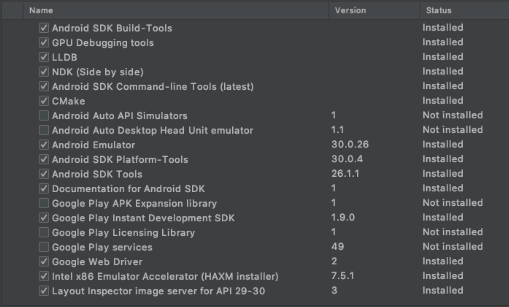
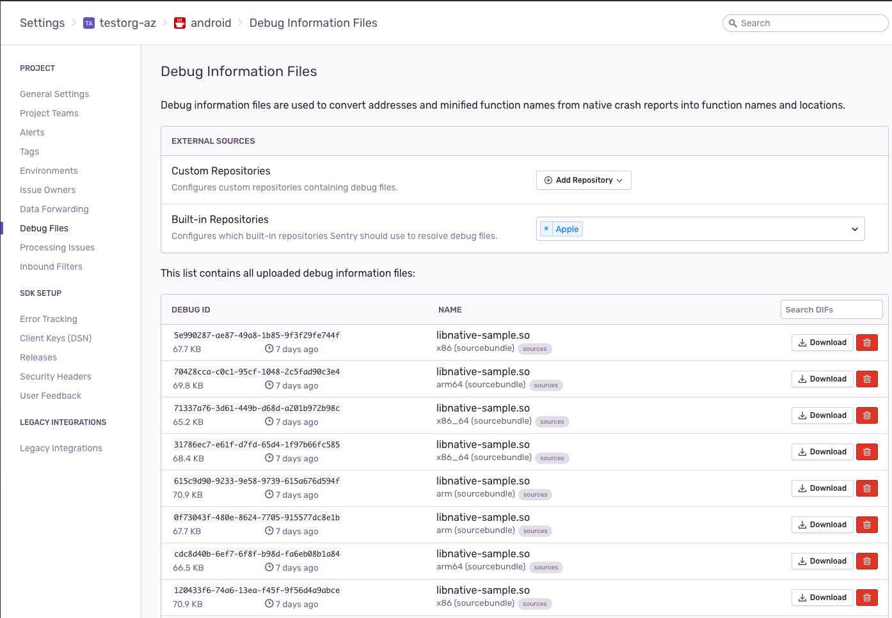
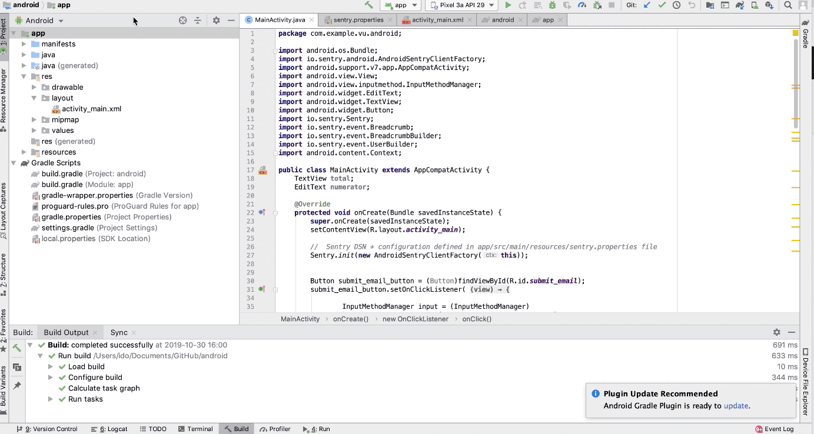

# Android Demo

This app demonstrates how to use Sentry in an Android application for capturing 4 types of exceptions:

- Unhandled Exceptions (2)
- Handled Exceptions
- Application Not Responding
- Native Crashes from C++ native code
- Message Capture

This app has all configuration (e.g. gradle) set to include Sentry SDK and ANR (Application Not Responding) and NDK (crash) events.

Sentry NDK libraries are used in addition to the Sentry SDK, for capturing errors and crashes in C++.

For use in **Production** see the [Official Sentry Android Documentation](https://docs.sentry.io/platforms/android/)
Additional documentation:
[ANR Configuration](https://docs.sentry.io/platforms/android/#configuration-options)
[NDK Configuration](https://docs.sentry.io/platforms/android/#integrating-the-ndk)

## Versions

| dependency    | version
| ------------- |:-------------:|
| sentry-java | 5.1.2 |
| sentry-android-gradle-plugin | 2.1.4 |
| Android Studio | 4.0.1 |
| Gradle | 6.5 |
| AVD | Nexus 5x API 29 x86, Pixel 2 API 29 |
| sentry-cli | 1.55.1 |
| macOS | Catalina 10.15.7 |
| java | 1.8.0_261 |
| jdk | 1.8 |

Do not use JDK 14
```
which java
/usr/bin/java
```

## Setup

1. `git clone git@github.com:sentry-demos/android.git`

2. Open project using Android Studio and set your Build Variant to 'release' instead of debug. Or else debug symbols won't get uploaded.
 Build Variants tab (left side of Android Studio) > Select 'release' under Active Build Variant Column > if that's missing then go to Build > Edit Build Types.

3. Sync the project with the Gradle files

    ```
    Tools -> Android -> Sync Project with Gradle Files

    In some Android Studio version this will be available under:

    File -> Sync Project with Gradle Files
    ```

4. Put your Sentry DSN key in `AndroidManifest.xml` and your 'project' name in the Makefile

5. For Performance Demo: Configure your GCP tool store domain in the `toolstore.domain` attribute in `AndroidManifest.xml`

6. Put your AUTH Token and project name in sentry.properties

7. `make all`

8. Android Studio install Android NDK in Preferences > System & Behavior > System Settings > Android SDK > SDK Tools > and install the following:




9. Maintain a separate branch which has your auth token.

10. Optional - Add se:<yourname> tag to buildConfigField in build.gradle.

## Run

1. `make all` if you haven't yet, or have made significant changes to your code. otherwise run the app.
2. Run 'app' in Android Studio on an Android Virtual Device.

## What's Happening

### Errors

The MainActivity has 5 buttons that generate the following exception types:

1. **Unhandled Error + Attachment** of type Arithmetic Exception
2. **Unhandled Error + Attachment** of type NegativeArraySizeException + Strips PII (removes user IP address in beforeSend)
3. **Handled Error + Attachment** of type ArrayIndexOutOfBoundsException
4. **ApplicationNotResponding (ANR)** Uses an infinite loop to crash the app after 5 seconds and reports event to Sentry.
5. **Native Crash** of type SIGSEGV from native C++. The Sentry NDK sends this to Sentry.io for symbolication
6. **Native Message** send custom event/message from native C++.

### Performance

The Android ToolStore demos the 2 classic toolstore transactions:
1. **toolstore [android]** -
    * Is the ToolStore activity load triggered by clicking on the tools icon in the top header
    * The transaction creates spans for loading the activity UI elements, calling the `/tools` flask backend, and processing the response

2. **checkout [android]** -
    * Add some items to the cart by clicking `Add to Cart`
    * Start the checkout transaction by clicking on the shopping cart icon
    * The transaction contains 3 spans (including a call to the flask `/checkout` endpoint
    * The transaction generates 2 errors - one on the Android side `Exception:Failed to init delivery workflow` and the `Not enough inventory for wrench` exception on the backend.


## Android Native Crash: Missing Symbols for System Libraries

The Android team has added Android system symbol files to our built-in repositories (Add the new Android option in your project settings). If the native crash generated from your emulator is not fully symbolicated, this probably means our symbol server doesn't have the files relevant for your (virtual) device. 
In this case, you can fix that by updating Sentry's server. To do that:

1. Download the `Symbol Collector` app  (**io.sentry.symbol.collector-Signed.apk**) which is available in the latest [release](https://github.com/getsentry/symbol-collector/releases/)
2. Install it on to your emulator by drag-and-dropping the apk into the emulator screen.
3. Run the Symbol Collector application
4. Configure the target URL to transport the symbols to: `https://symbol-collector.services.sentry.io`
5. Click `Collect Symbols`
6. Once the transport completes, re-generate the crash.

## Release Health Testing
Use two different devices (ie. two different android emulators). Keep one device crash free and one that has crashes so you can compare the crash free user rates.
1. Select second device, different from the primary device you threw errors and crashes in
2. Click Play/run
3. Remember - do NOT click buttons and cause errors! you want to keep this one Crash Free. You could always make a new release if you want 100% crash free rates again.

1st device - errors, so you see Crash Free Rate go Down
2nd device - sessions w/out errors, so if you keep creaitng healthy sessions, the nCrash Free Rate should go back up

ANR - click button, then start clicking on other areas of the screen. The second click (not the button click) is when it starts counting the seconds
right when pop-up comes , event should be sent to Sentry. click 'close-up'.

See AndroidManifest.xml for different settings we tweak for demo's (e.g. default Session time, default ANR time

## How To Make a New Release

:warning: Only follow these steps when on the `master` branch, with no untracked git changes. This is necessary because we rely on these releases for our automated test data ("TDA") and don't want unintended local modifications (i.e. to DSNs or project names) to accidentally make it into our automated data. :warning:

### Part 1: Generate Release artifacts

1. **Increment both `versionName` and `versionCode` by 1 in `build.gradle`.** I.e. in the below example, we updated versionCode from `12` to `13` and versionName from `1.2.0` to `1.3.0`. Then run the app once so the executable gets this updated value.
```
defaultConfig {
    applicationId "com.example.vu.android"
    minSdkVersion 21
    targetSdkVersion 29
    versionCode 13
    versionName "1.3.0"
}
```

(This would make for a release of `1.3.0 (13) com.example.vu.androidh@1.3+13`.)

2. **Run `./generate_release_artifacts.sh`, which generates debug-build and release-build `.apk` files.**
3. **Checkout a new git branch (if your release version is 1.3.0, you can call the branch 1.3.0). Commit the changes to `build.gradle`, `app-release.apk`, and `app-debug.apk`.**
4. **Push up the changes in a pull request.**
5. **Get an approval and merge the changes.**

### Part 2: Create the Github release

1. After completing the steps in Part 1, and once your release branch is merged in, checkout the `master` branch and pull down the latest changes. Ensure your branch is clean (no untracked git changes).
2. Run `./github_release.sh`, and select `y` when prompted.
3. That's it. You'll see that a new release was created in https://github.com/sentry-demos/android/releases.
4. You may need to restart your demo automation tools so they'll still hitting the latest APK release.

### Other Notes on releases

The version code is unique. This is already part of build system in Android. The app won't compile without it.

Optional - Setting the release in AndroidManifest.xml will override what's set in src/build.gradle. Possible uses cases would be:
1. indicating Paid vs Free versions of your apps
2. match versionf for your Android and iOS apps together. force a release name.
3. the pattern 'package@name+version' is new from Sentry, so you could override that in AndroidManifest.xml
4. Good for testing if you're iterating quickly, but not publishing your app.
```
<meta-data android:name="io.sentry.release" android:value="io.sentry.sample@1.0.0+1" />
```

## How To Upgrade SDK
1. increment sdk numbers in src/build.gradle like:
```
    implementation 'io.sentry:sentry-android:5.6.0'
    implementation 'io.sentry:sentry-android-okhttp:5.6.0'
    implementation 'io.sentry:sentry-android-fragment:5.6.0'
``` 
2. Consider making a new Release
3. click 'Sync Now' for sync'ing your gradle files in AndroidStudio
4. `make all` will do a new `./gradlew build`

## ANR
Sometimes you'll see extra ANR events, because you have setting set to 3 seconds
Hard to compare Total Number of Crashes to a report in Discover on handled:no and the release, because when a crash happens, you have to wait for the device to come back online again.
There are some other technical reasons as well, which are still being sorted out.
For instance, if you're ever filtering, sampling or Rate Limiting events/crashes out, then it's possible that the Sessions data isn ot getting filtered/sampled and so your Crash Free rate will appear higher than it actually is.

## Sessions
- if you put app to background, and put to foreground in less than 30seconds, it does not create new Session
- if you put app to background, and wait more than 30seconds, then put to foreground, it will create new session
- swiping up "close"", there's no way to know what happened to the Session. it's not a error/crash. it's a normal exited session.
    - opening the app again right away, should great a fresh new session
- i write 30seconds here, but we set our default in AndroidManifest.xml to "3seconds" for demo purposes
- if device has a stable connection, events sent right away
    - SentryServer has a pipeline that's queuing events, depends on state of Sentry
    - c++ crashes go through Symbolicator which has its own queuing and symbolication takes longer
        - need to restart the app
- Session (ending) is sent when App goes to Background OR there's a crash
- Session data is sent when Session Starts and when Session Ends
- So if you make a Handled Error, the Session data is not sent just yet. updates the session only locally in the device.

## Misc Knowledge
- Release dashboard, open 1, 'All Issues' is issues across all the releases
- Release dashboard, open 1, 'New Issue' sometimes not populating...
- View Data in Discover if things aren't adding up / looking right in the Release Page
- see Notion page on 'Crashes in SDKs and Product' for status updates on this stuff
- `mechanism:signalHandler` comes from sentry-native and `mechanism:uncaughtException` comes from java/kotlin
- Now (06/02/2020) ANR reported only if the pop-up comes up. doing 5seconds like Google does
- When there's not a lot data yet, it's hard to calculate/show things.
- Unique Users isn't the user's email, it's the Device. so in Discover could try things (but not working) like user.id, device.uuid, device. We didn't want to use sensitive data for Sessions. We generate a uuid for the user - Installation ID of the app on that device
- Check Documentation, things may have changed.

## GIF Android Java Exception


## GIF Android ANR



## GIF Android Native Crash C++


Previously we were on Android Gradle Plugion Version 4.0.1
Previously we were on Gradle Version 6.5

tried
7.0.4
7.4

7.0
7.0

https://docs.sentry.io/platforms/android/configuration/integrations/room-and-sqlite/
https://docs.sentry.io/platforms/android/configuration/integrations/file-io/

https://docs.sentry.io/platforms/android/gradle/
https://github.com/getsentry/sentry-android-gradle-plugin
JDK 11 required
https://developer.android.com/studio/releases/gradle-plugin#7-0-0


https://www.oracle.com/java/technologies/javase/jdk11-archive-downloads.html
```
 ~   /usr/libexec/java_home -v 8
Unable to find any JVMs matching version "8".
/Library/Java/JavaVirtualMachines/jdk1.8.0_261.jdk/Contents/Home
 ~   /usr/libexec/java_home -v 8
Unable to find any JVMs matching version "8".
/Library/Java/JavaVirtualMachines/jdk-11.0.13.jdk/Contents/Home
 ~   /usr/libexec/java_home -v 11
/Library/Java/JavaVirtualMachines/jdk-11.0.13.jdk/Contents/Home
 ~
```
and
```
 /Library/Java/JavaVirtualMachines   which java
/usr/bin/java
 /Library/Java/JavaVirtualMachines   java -version
java version "1.8.0_261"
Java(TM) SE Runtime Environment (build 1.8.0_261-b12)
Java HotSpot(TM) 64-Bit Server VM (build 25.261-b12, mixed mode)
 /Library/Java/JavaVirtualMachines   java -version
java version "11.0.13" 2021-10-19 LTS
Java(TM) SE Runtime Environment 18.9 (build 11.0.13+10-LTS-370)
Java HotSpot(TM) 64-Bit Server VM 18.9 (build 11.0.13+10-LTS-370, mixed mode)
 /Library/Java/JavaVirtualMachines
```


current:
/Applications/Android Studio.app/Contents/jre/jdk/Contents/Home

trying:
/Library/Java/JavaVirtualMachines/jdk-11.0.13.jdk/Contents/Home


also...
https://stackoverflow.com/questions/68321708/could-not-run-phased-build-action-using-connection-to-gradle-distribution
https://stackoverflow.com/questions/32887623/errorcould-not-run-build-action-using-gradle-installation-gradle-2-4-android
upgrading gradle...wrapper
https://gradle.org/install/

. Android Studio Arctic Fox bundles JDK 11 and configures Gradle to use it by default, which means that most Android Studio users do not need to make any configuration changes to their projects.

I have SDK Tools +v30

https://developer.android.com/studio/releases/gradle-plugin#7-0-0
https://developer.android.com/studio/releases/build-tools