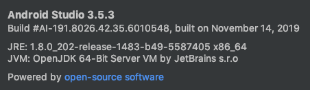

# Android Demo

This app demonstrates how to use Sentry in an Android application for capturing 4 types of exceptions:

- Unhandled Exceptions (2)
- Handled Exceptions
- Application Not Responding
- Native Crashes from C++ native code

This app has all configuration (e.g. gradle) set to include Sentry SDK and ANR (Application Not Responding) and NDK (crash) events.

Sentry NDK libraries are used in addition to the Sentry SDK, for capturing errors and crashes in C++.

For use in **Production** see the [Official Sentry Android Documentation](https://docs.sentry.io/platforms/android/)
Additional documentation:
[ANR Configuration](https://docs.sentry.io/platforms/android/#configuration-options)
[NDK Configuration](https://docs.sentry.io/platforms/android/#integrating-the-ndk)

## Versions

| dependency    | version
| ------------- |:-------------:|
| Android Studio | 3.5.3 |
| Gradle | 5.6.4 |
| AVD | Nexus 5x API 29 x86 |
| sentry-cli | 1.4.9 |
| macOS | Mojave 10.14.4 |




## Setup

1. `git clone git@github.com:sentry-demos/android.git`

2. Open project using Android Studio

3. Sync the project with the Gradle files

    ```
    Tools -> Android -> Sync Project with Gradle Files
    ```

4. Put your Sentry DSN key in `AndroidManifest.xml`
5. `make all`

You can see debug files were uploaded in your Project Settings


## Run
1. Run 'app' in Android Studio on an Android Virtual Device.

## What's Happening

The MainActivity has 5 buttons that generate the following exception types:

1. **Unhandled Exception** of type Arithmetic Eception
2. **Unhandled Exception** of type NegativeArraySizeException
3. **Handled Exception** of type NumberFormatException
4. **ApplicationNotResponding (ANR)** Uses an infinite loop to crash the app after 5 seconds and reports event to Sentry.
5. **Native Crash** of type SIGSEGV from native C++. The Sentry NDK sends this to Sentry.io for symbolication

## GIF Android Java Exception


## GIF Android ANR


## GIF Android Native Crash C++

